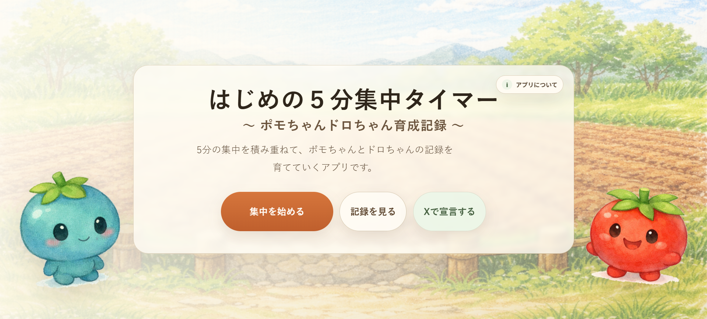
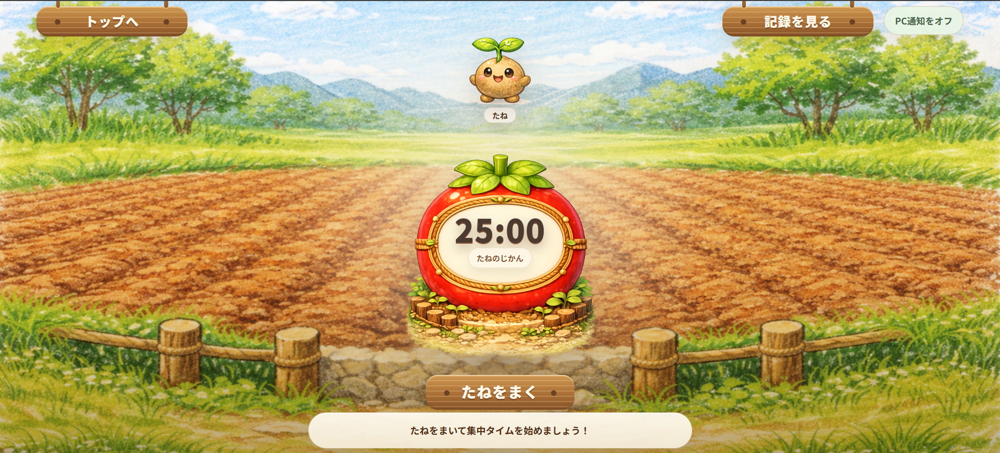
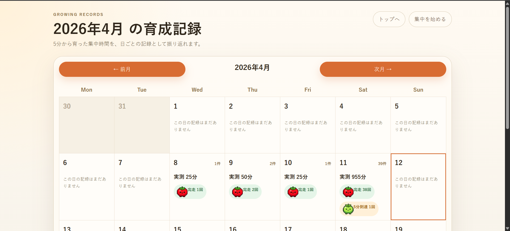
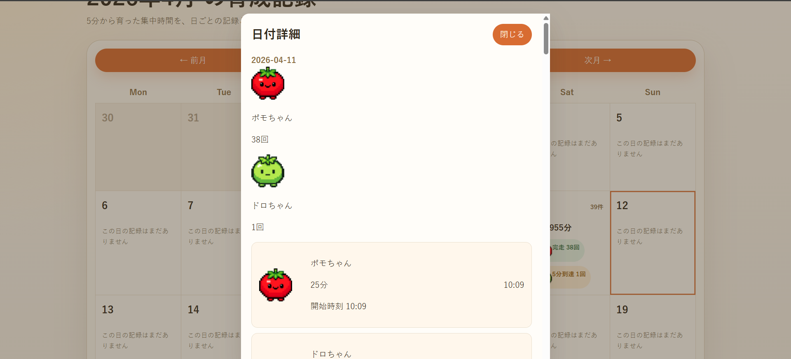

# はじめの５分集中タイマー
## 〜 ポモちゃんドロちゃん育成記録 〜

「まず5分だけ始めてみる」を後押ししながら、集中の積み重ねをやさしく振り返れる Rails アプリです。

## アプリ概要

はじめの５分集中タイマーは、25分固定のタイマーで集中を記録するアプリです。  
いきなり長時間が難しいときでも、まず5分だけ始めてみるきっかけを作り、その積み重ねをポモちゃんとドロちゃんの成長として残せます。

5分未満で止めたタイマーは保存しません。5分を超えた集中だけを記録し、25分完走したら1セッション完了として扱います。  
あとからカレンダー画面で日ごとの記録を見返せるので、「始められた日」も「続けられた日」も振り返りやすい構成です。

## できること

- 25分タイマーで集中を始める
- 5分以上の集中だけを記録する
- 25分完走時に達成演出を見る
- カレンダーで日ごとの成果を振り返る
- X で「これから集中する」を宣言する

## 画面イメージ

### トップ画面

トップ画面では、アプリのコンセプトを確認しながら、タイマー開始・記録確認・X 宣言へ自然に進めます。



### タイマー画面

タイマー画面では、トマト型のキッチンタイマー風 UI で集中を進めます。5分到達で記録対象になり、25分完走で1セッション完了です。



### カレンダー画面

カレンダー画面では、日ごとの件数や合計集中時間、ポモちゃん・ドロちゃんの記録をまとめて振り返れます。



### 日付詳細モーダル

日付を開くと、その日の開始時刻、集中時間、達成種別をモーダルで確認できます。



## 使い方

### 1. トップ画面から「集中を始める」を押す

タイマー画面へ移動します。必要に応じて、X 宣言ボタンから「これから5分、集中をはじめます。」と投稿することもできます。

### 2. タイマーを開始する

タイマーは 25 分固定です。  
`たねをまく` を押すとカウントダウンが始まり、集中の最初の5分を後押しします。

### 3. 5分到達で記録対象になる

5分以上続いたタイマーだけを保存対象にしています。  
この時点で `FocusSession` を作成し、途中で止めても「5分は続けられた記録」が残る設計です。

### 4. 25分完走で1セッション完了

25分完走すると同じ `FocusSession` に完了情報を保存し、ポモちゃんの完了演出が表示されます。

### 5. カレンダーで振り返る

保存した集中記録はカレンダー画面で確認できます。  
日付を開くと、その日の開始時刻や集中時間、達成種別も見返せます。

## 現在の仕様

- タイマーは 25 分固定です
- 5分到達時に `duration_seconds: 300` を保存します  
  `duration_seconds` は、その時点までに記録した集中秒数です
- 25分完了時に `duration_seconds: 1500` と `completed_at` を更新します  
  `completed_at` は、25分完了した時刻です
- 5分到達時に `FocusSession` を作成します  
  `FocusSession` は、集中記録1件を表すモデルです
- 同一 user + started_at の重複 POST は既存レコードを再利用します
- 完了済みセッションへの再 PATCH は `409 Conflict` を返します  
  `409 Conflict` は、「その記録はすでに完了済みなので更新できない」ことを示す応答です
- タイマー進行中は、不整合を避けるため一部導線を制御しています

## 匿名ユーザー方式について

このアプリにはログイン機能はありません。初回アクセス時に匿名ユーザーを自動作成し、同じブラウザの中では継続して使えるようにしています。

### cookie で保持しているもの

- `anonymous_token`  
  同じブラウザ利用者を識別するための値です

### localStorage で保持しているもの

- `startedAt`  
  現在のタイマー開始時刻です
- `focusSessionId`  
  保存済みの集中記録 ID です
- `postedStartedAt`  
  5分到達 POST の重複防止に使う値です
- `completionNotificationEnabled`  
  PC 通知をアプリ内でオンにしているかを保持する値です

役割を分けると、`anonymous_token` は「誰の記録か」を見分けるための値、`localStorage` は「今どのタイマーを動かしているか」を復元するための値です。

## この設計にした理由

このアプリでは、「長く続けられたか」だけではなく、「まず始められたか」を大切にしたかったため、5分以上の集中だけを記録する設計にしています。

そのため、

- 5分未満で止めたものは保存しない
- 5分到達で記録開始にする
- 25分完走で完了扱いにする

という流れにしています。  
最初のハードルを下げながら、積み重ねた集中はきちんと残せるようにした構成です。

## 使用技術

- Ruby
- Ruby on Rails
- JavaScript
- MySQL
- HTML / CSS
- Docker

## 開発環境セットアップ

このプロジェクトでは、Rails と RSpec を Docker 内で実行する前提に統一しています。  
ホスト側では `DATABASE_HOST=db` を名前解決できないため、`bundle exec rspec` を直接ホストで実行しません。

### 初回セットアップ

```bash
bin/docker-setup
```

このスクリプトでは、以下をまとめて行います。

- `docker compose up -d`
- development DB の `db:prepare`
- test DB の `db:prepare`

### アプリ起動

```bash
docker compose up -d
```

ブラウザで `http://localhost:3000` を開きます。

## 動作確認方法

### 手動確認

- トップ画面からタイマー / 記録 / X 宣言へ進める
- `たねをまく` でタイマーが開始する
- 5分未満で停止した場合は保存されない
- 5分到達後に停止した場合は途中記録が残る
- 25分完了で演出が表示される
- カレンダー画面で保存済みセッションを確認できる
- ページ再訪時に `localStorage` からタイマー状態が復元される

### RSpec 実行

標準手順:

```bash
bin/rspec
```

主要画面まわりだけ確認する場合:

```bash
bin/rspec spec/requests/pages_spec.rb
bin/rspec spec/system/top_page_spec.rb
bin/rspec spec/system/calendar_page_spec.rb
bin/rspec spec/system/timer_completion_flow_spec.rb
bin/rspec spec/system/timer_restore_ui_spec.rb
```

直接 Docker コマンドを使う場合:

```bash
docker compose exec -e RAILS_ENV=test web bundle exec rspec
```

### test DB の再準備

```bash
docker compose exec -e RAILS_ENV=test web bin/rails db:prepare
```

## 既知の制約

- cookie を削除すると履歴が失われます
- ブラウザや端末をまたぐ履歴共有はできません
- シークレットモードでは履歴保持が安定しません
- タイマー状態の復元は `localStorage` に依存します
- 複数タブの同時操作では、最終防衛はサーバー側の重複防止と conflict 応答に依存します
- PC 通知はブラウザ権限と OS 側の通知設定に依存します
- Windows の応答不可や集中モードが有効なときは、`Notification` の生成に成功してもバナー通知が表示されないことがあります

## 開発上の運用ルール

- RSpec はホストではなく Docker 内で実行します
- `docker compose run` ではなく、基本は `docker compose exec web ...` を使います
- 先に `docker compose up -d` で常駐コンテナを起動してから操作します
